# slimUG
slightly modified Ubuntu Gnome

sli(ghtly) m(odified) U(buntu) G(nome) is a personal project based on sli(ghtly) m(odified) Advaita theme and a modified White shell theme with the addition of original icons (which are developed based on most used apps), using dash-to-dock extension to create a clean and beautiful interface.

Adwaita theme has been augmented with original circle-based window control icons and SpaceFM circle-based panel icons and a collection of beautiful walpapers and carefully crafted dark colored icons for most used apps.

The White shell theme has been modified with blurred panel and dock bars, which are unified in the top left corner and with the window title bar in order to provide a consistent look for the shell interface.

A series of recommended gnome shell extensions have been added: Activities configurator, Dash to dock, Force quit, to name just a few.

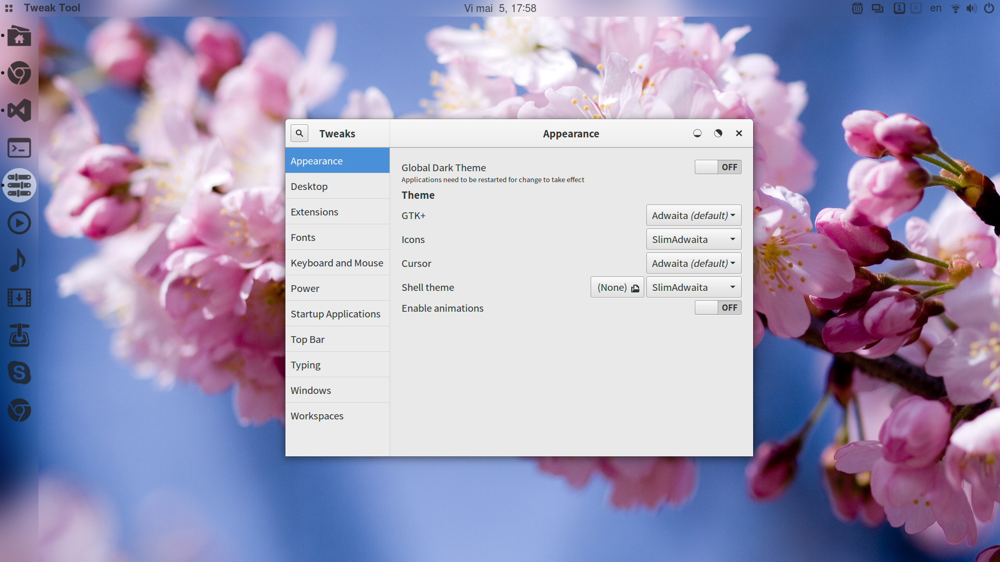
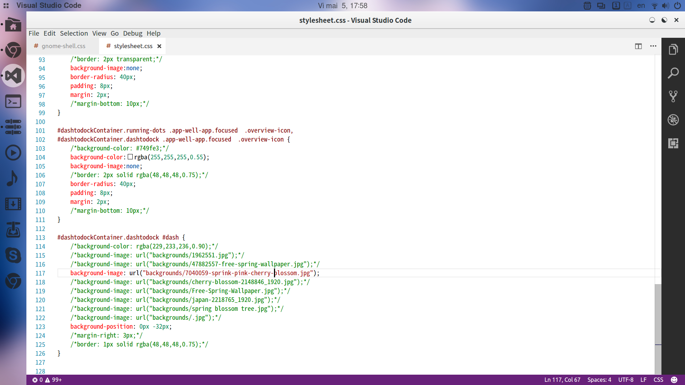
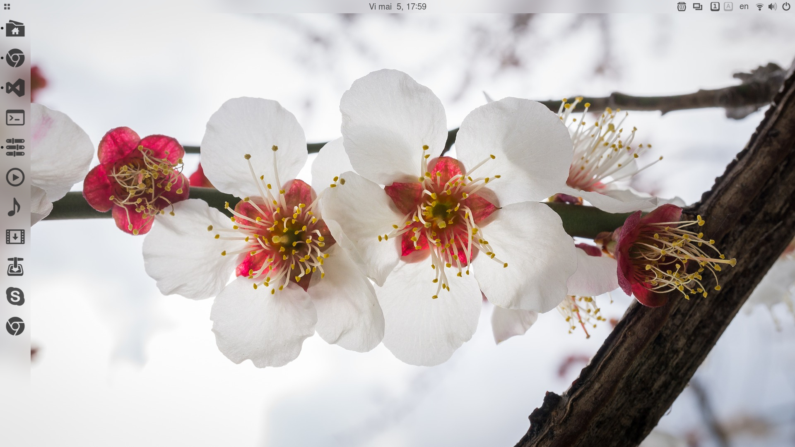
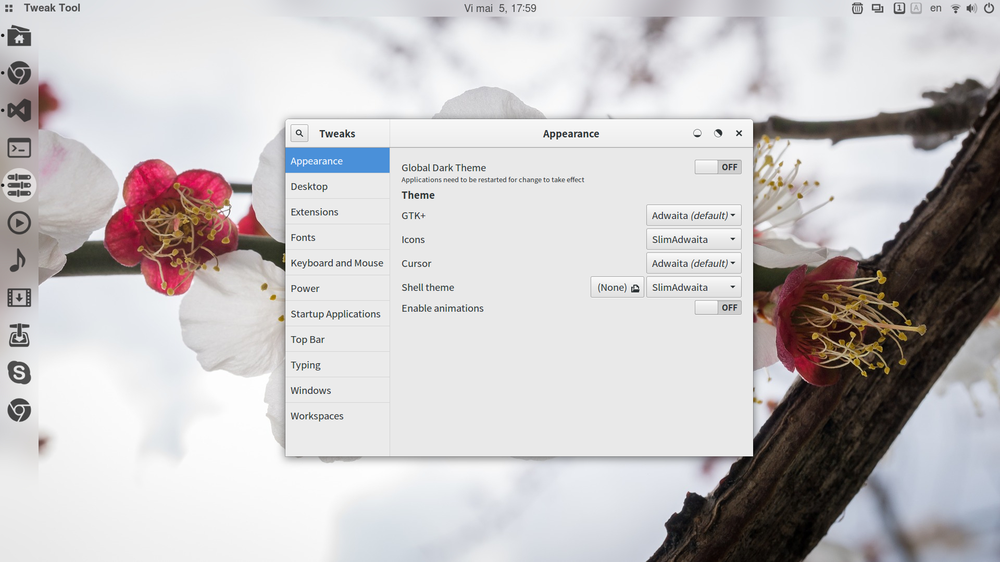

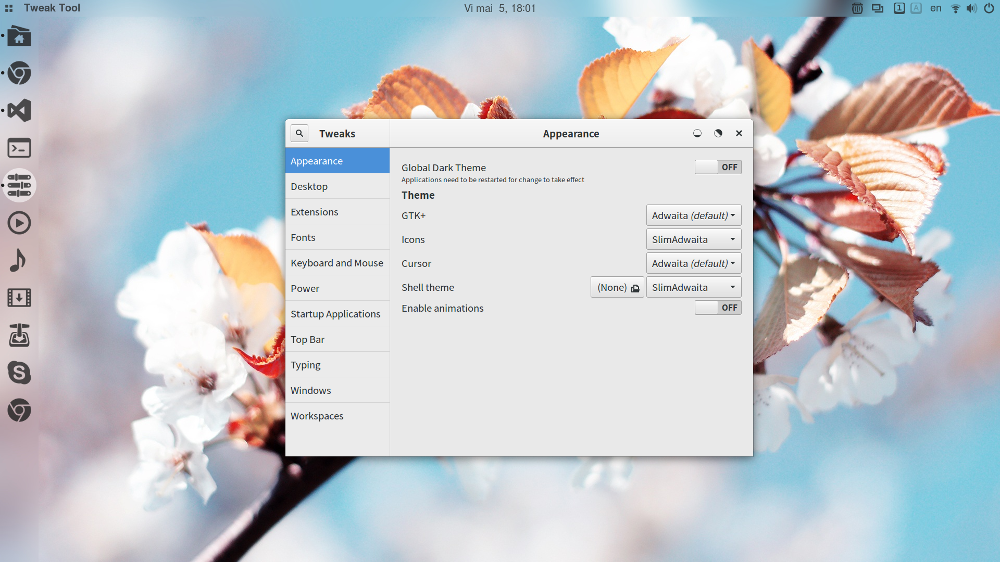
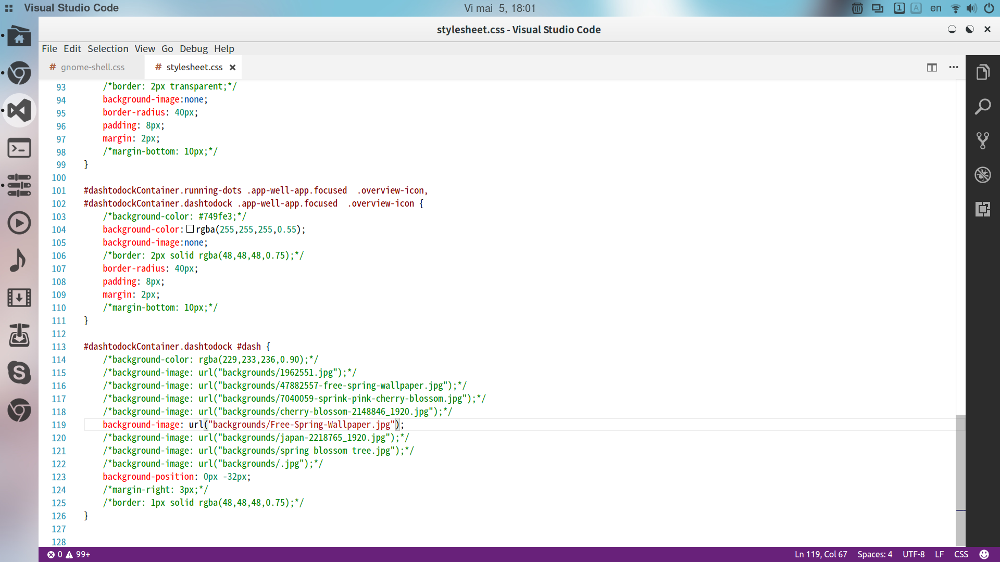
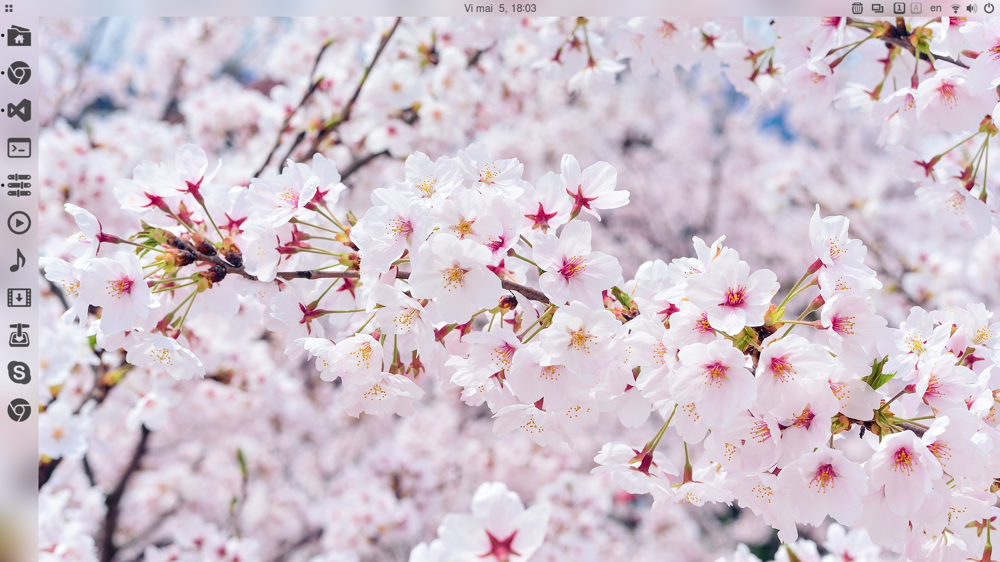
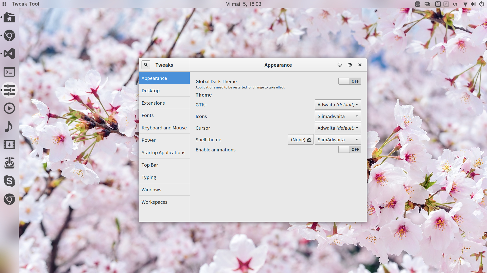
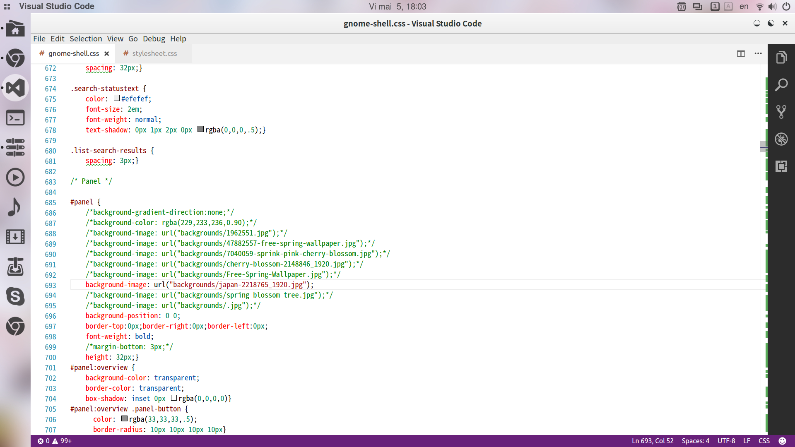
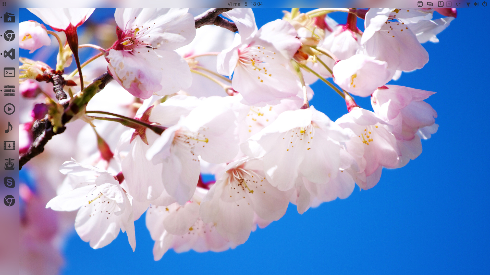
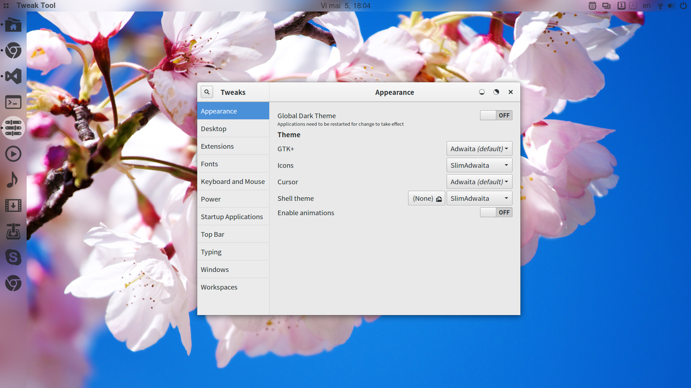
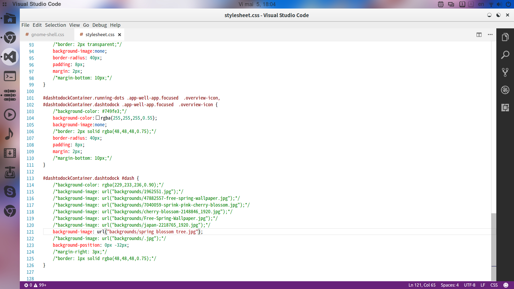