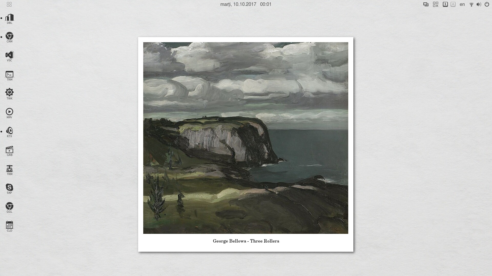
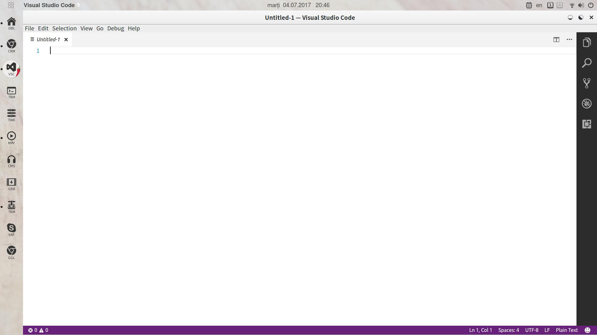
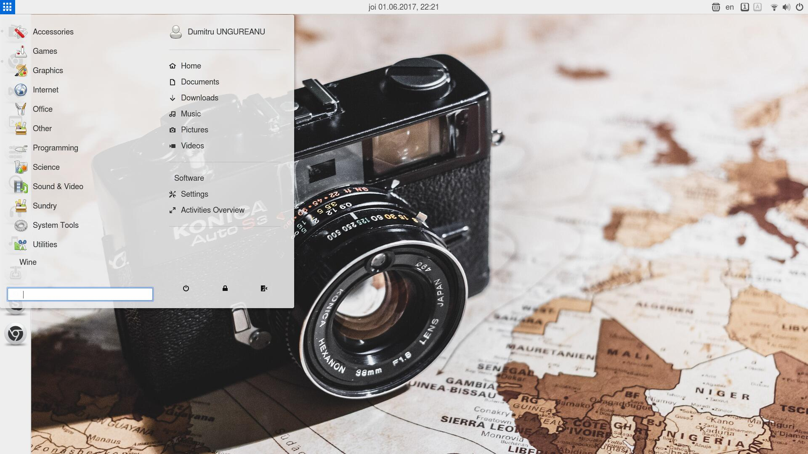

# slimUG
slightly modified Ubuntu Gnome
Painting Medalions

sli(ghtly) m(odified) U(buntu) G(nome) is a personal project based on sli(ghtly) m(odified) Advaita theme and a modified White shell theme.
Featuring dark app icons and original circle-based window control icons, a curated painting backgrounds collection.

Recommended extensions list:
* Activities configurator
* Arc menu
* BackSlide
* Clock override
* Dash to dock, with modified theme
* fix-multi-monitors
* Force Quit
* Hide Legacy Tray
* Lock Keys
* Multi Monitors Add-On
* No Topleft Hot Corner
* NoAnnoyance
* Removable Drive Menu
* Remove Accessibility
* Remove Dropdown Arrows
* ShutdownTimer
* Sound Input & Output Device Chooser
* Trash
* Turn off Display
* User Themes

