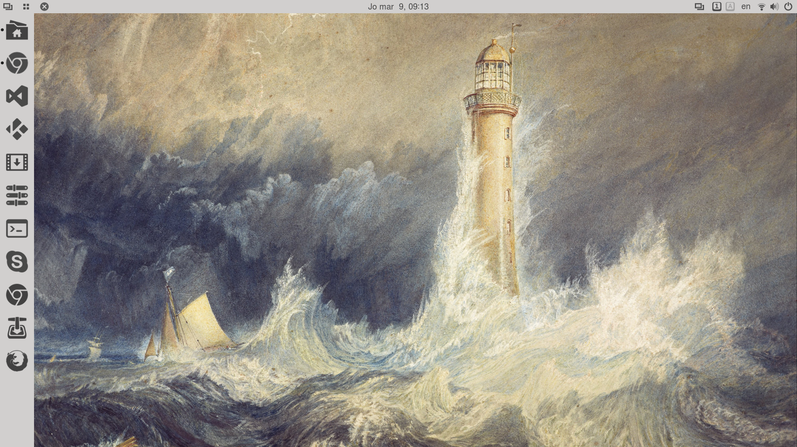
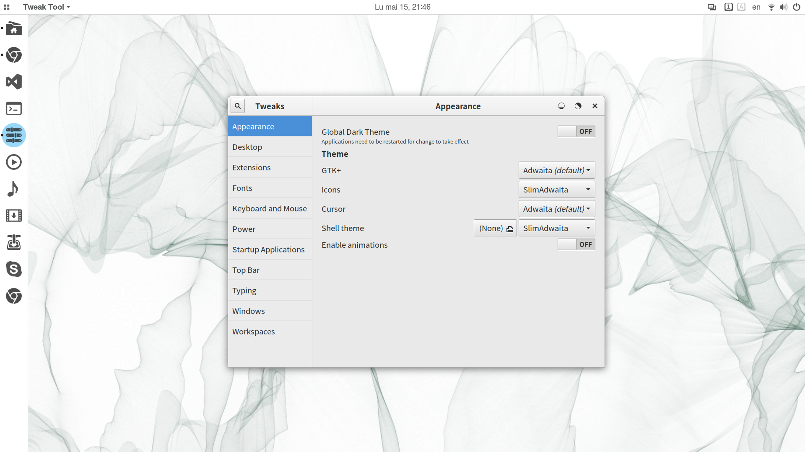
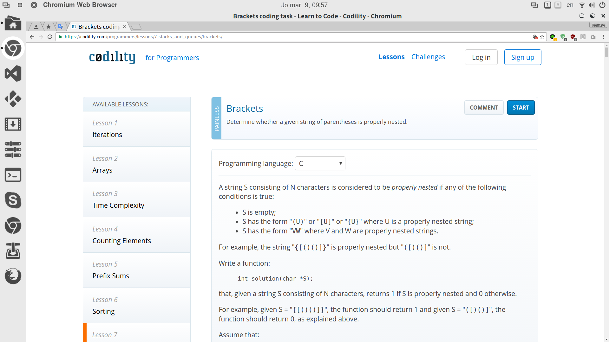
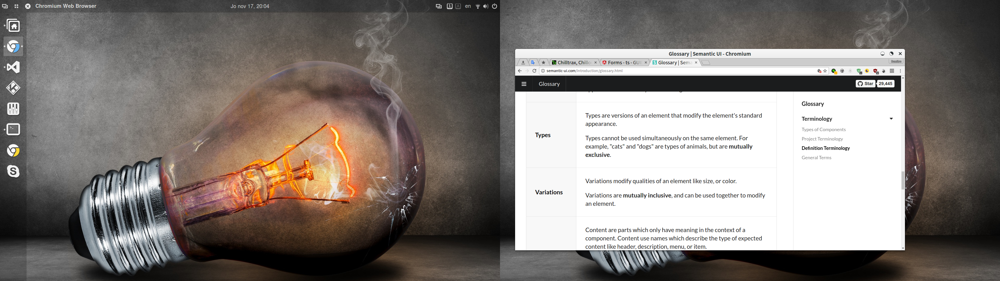
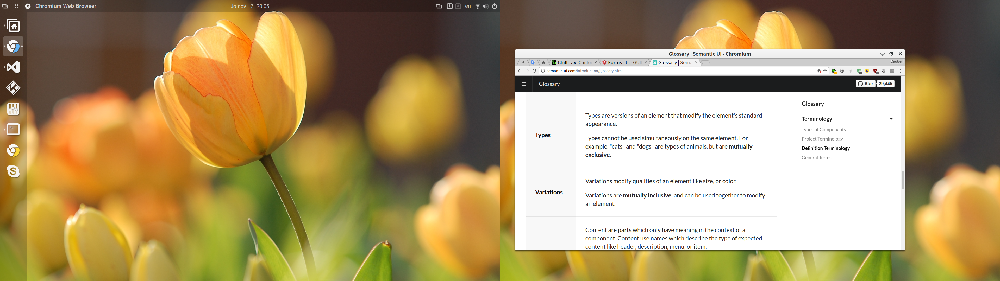
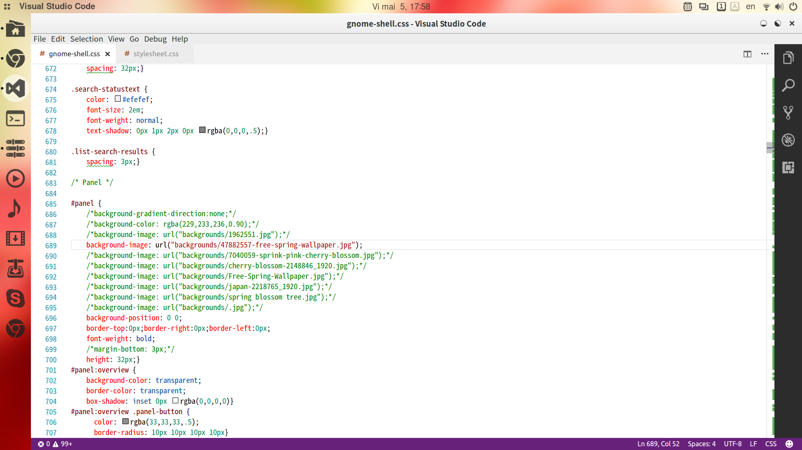
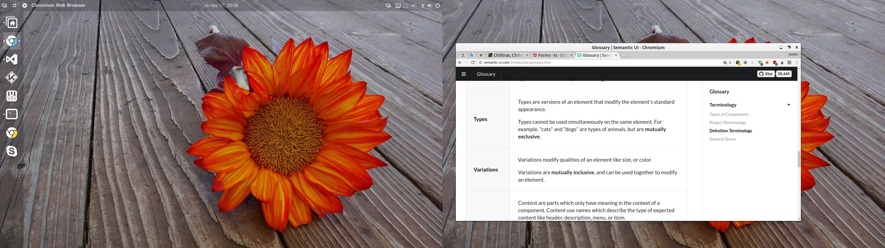

# slimUG
slightly modified Ubuntu Gnome

sli(ghtly) m(odified) U(buntu) G(nome) is a personal project based on sli(ghtly) m(odified) Advaita theme and a modified White shell theme with the addition of original icons (which are developed based on most used apps), using dash-to-dock extension to create a clean and beautiful interface.

Adwaita theme has been augmented with original circle-based window control icons and SpaceFM circle-based panel icons and a collection of beautiful pexel.com walpapers and carefully crafted light colored icons for most used apps, with added color accents where similar icons could create confusion: Chromium vs. Google Chrome.

The White shell theme has been modified with transparent panel and dock bars, which are unified in the top left corner in order to provide a consistent look for the shell interface.

A series of recommended gnome shell extensions have been added: Activities configurator, Dash to dock, Force quit, to name just a few.

