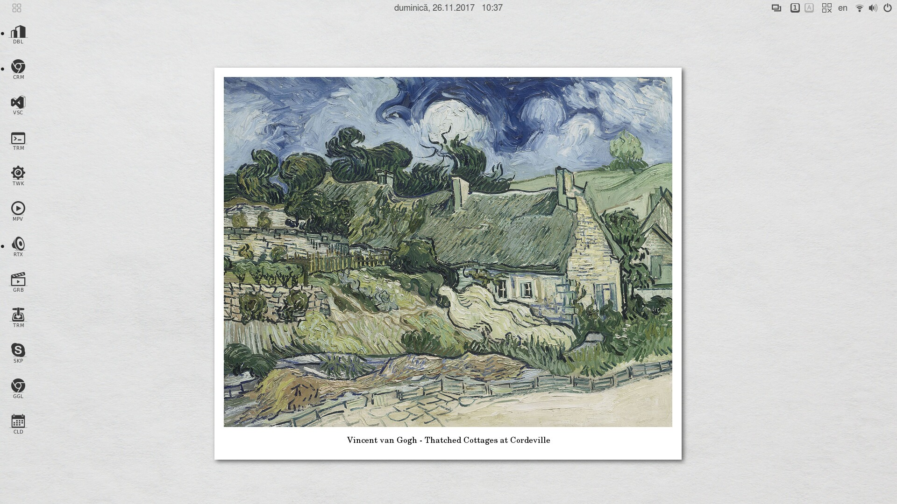

# slimUG
slightly modified Ubuntu Gnome

sli(ghtly) m(odified) U(buntu) G(nome) is a personal project based on sli(ghtly) m(odified) Advaita theme and a modified White shell theme.
Orb icons and original circle-based window control icons have been added.

