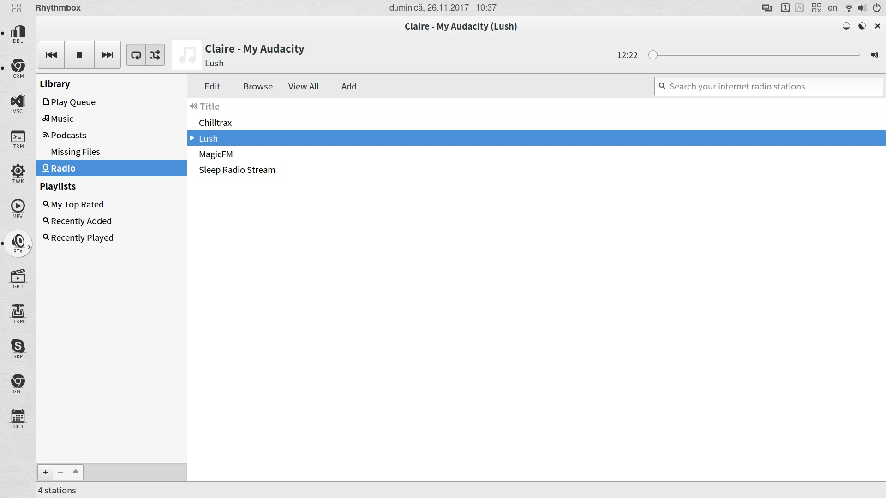

# slimUG
slightly modified Ubuntu Gnome

sli(ghtly) m(odified) U(buntu) G(nome) is a personal project based on sli(ghtly) m(odified) Advaita theme and a modified White shell theme.
Featuring dark app icons and original circle-based window control icons.

Extension list:
* Activities configurator
* Arc menu
* Clock override
* Dash to dock, with modified theme

